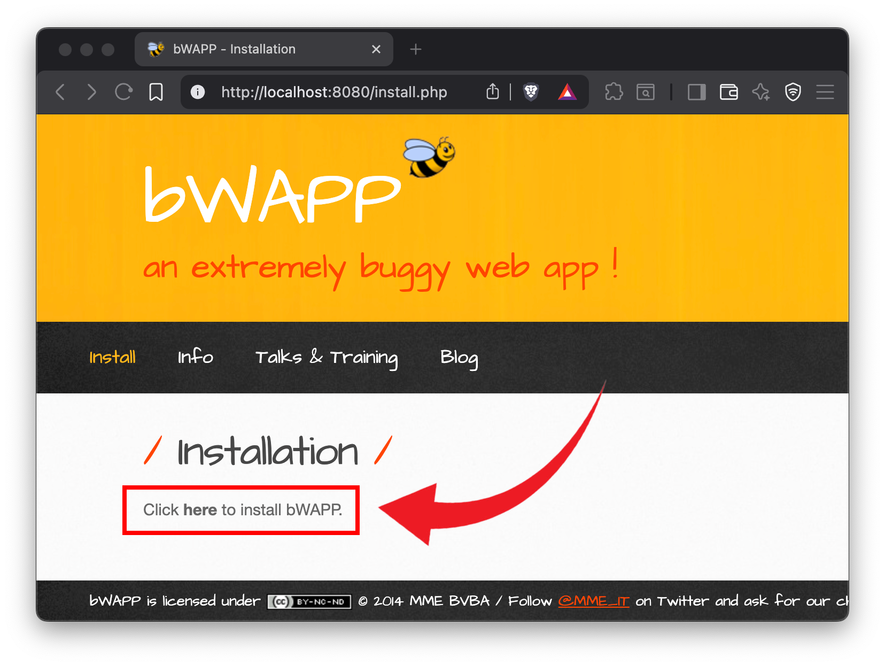
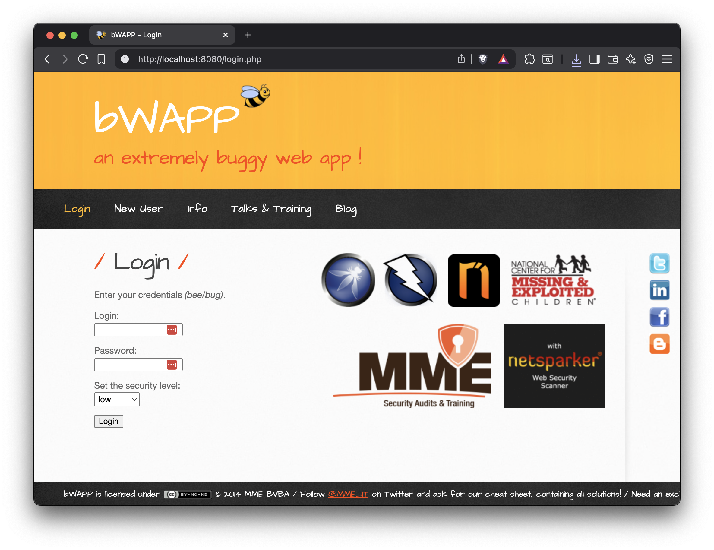

# Última modificação do bWAPP para PHP 7.4 empacotada em container Docker

## Setup inicial

1. Clone o repositório e entre na pasta

```bash
git clone https://github.com/thau0x01/bwapp-turma1-ufpe.git bwapp

cd bwapp
```

2. Suba o container com o comando:

```bash
docker compose up -d --build
```
> [!WARNING]  
> Caso o comando acima não funcione, use este: `docker-compose up -d` ou use o Docker Desktop

3. Abra **[http://localhost:8080/install.php](http://localhost:8080/install.php)** e clique no link `here` exibido na página.


4. Vá para **[http://localhost:8080/login.php](http://localhost:8080/login.php)**


> [!TIP]
> 5. Pronto.

---

## bWAPP - README

bWAPP é um aplicativo web propositalmente vulnerável.
Ele ajuda entusiastas de segurança, desenvolvedores e estudantes a identificar e prevenir vulnerabilidades web.
Serve como base para treinar testes de invasão e projetos de hacking ético.
O diferencial? Mais de 100 falhas disponíveis para estudo.
Cobre praticamente todas as vulnerabilidades conhecidas, incluindo todos os riscos do OWASP Top 10.
É destinado exclusivamente para testes de segurança e fins educacionais.

Inclui:

* Injeções: SQL, SSI, XML/XPath, JSON, LDAP, HTML, iFrame, comandos de sistema e SMTP
* XSS, XST e CSRF
* Uploads irrestritos e backdoors
* Problemas de autenticação, autorização e gerenciamento de sessão
* Acesso arbitrário a arquivos e *directory traversal*
* Inclusão de arquivos locais e remotos (LFI/RFI)
* SSRF
* XXE
* Vulnerabilidade Heartbleed (OpenSSL)
* Shellshock (CGI)
* SQL Injection no Drupal (Drupageddon)
* Falhas de configuração: MITM, política cross-domain, vazamento de informações…
* Poluição de parâmetros HTTP e *response splitting*
* Ataques DoS
* HTML5 Clickjacking, CORS e problemas de Web Storage
* Redirecionamentos não validados
* Manipulação de parâmetros
* Vulnerabilidade PHP-CGI
* Armazenamento criptográfico inseguro
* Problemas com AJAX e Web Services (JSON/XML/SOAP)
* Envenenamento de cookies e reset de senha
* Configurações inseguras de FTP, SNMP e WebDAV
* E muito mais...

bWAPP é uma aplicação PHP que usa MySQL. Pode ser hospedado em Linux ou Windows usando Apache/IIS e MySQL. Pode ser instalado com WAMP ou XAMPP.

Também existe a *bee-box*, uma VM já preparada com o bWAPP instalado.
Clique neste link para baixar a *bee-box*: [https://sourceforge.net/projects/bwapp/files/bee-box/](https://sourceforge.net/projects/bwapp/files/bee-box/)

Existe ainda um tutorial em PDF utilizado originalmente num curso intensivo de 2 dias: **“Attacking & Defending Web Apps with bWAPP”**, oferecido pelos autores originais.
O documento em formato PDF está em: [assets/bWAPP_intro.pdf](assets/bWAPP_intro.pdf) (pdf)

Aproveite!

---

**Créditos do autor original**
Malik Mesellem
Twitter: @MME_IT
